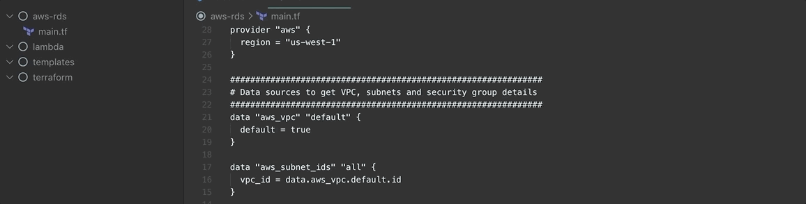

<strong>Workspace / session / project management focused on usability and simplicity. Create and switch workspaces with a keystroke.</strong>

## Features

- Create a new session (changes will be automatically saved after creation)
  Command `sessions.save`: Default: `Ctrl+Alt+W`

- Load/Switch existing sessions
  Command `sessions.open`: Default: `Ctrl+Alt+E`
- Delete unused sessions
  Command `sessions.delete`: Default: `Ctrl+Alt+D`

Keybindings can be customized in the keybindings.json
